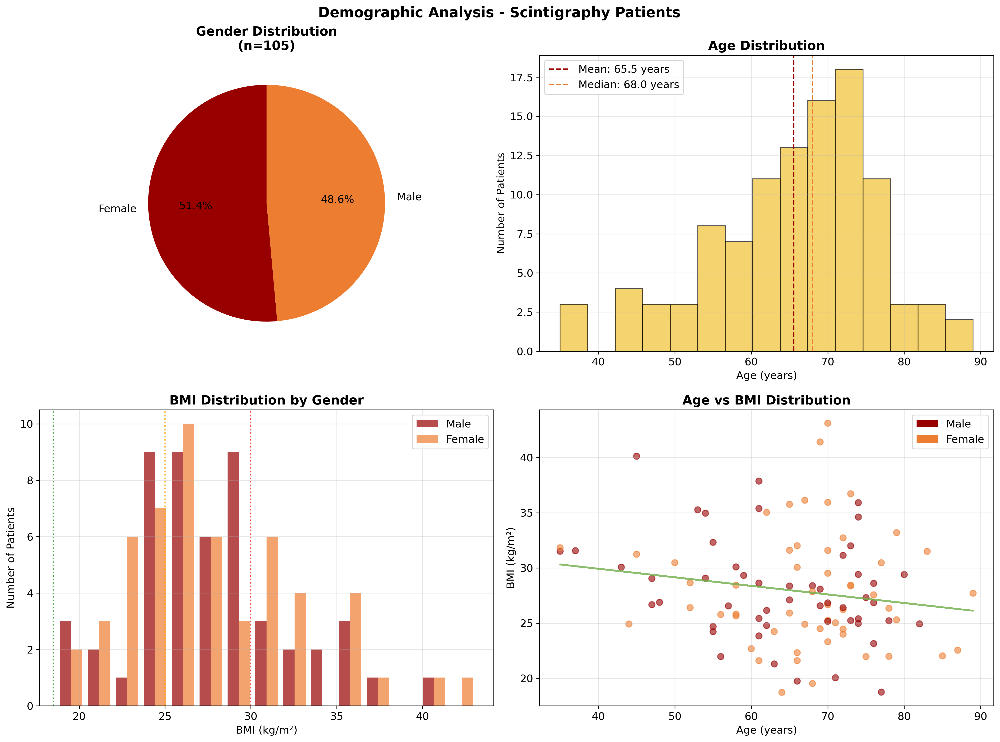
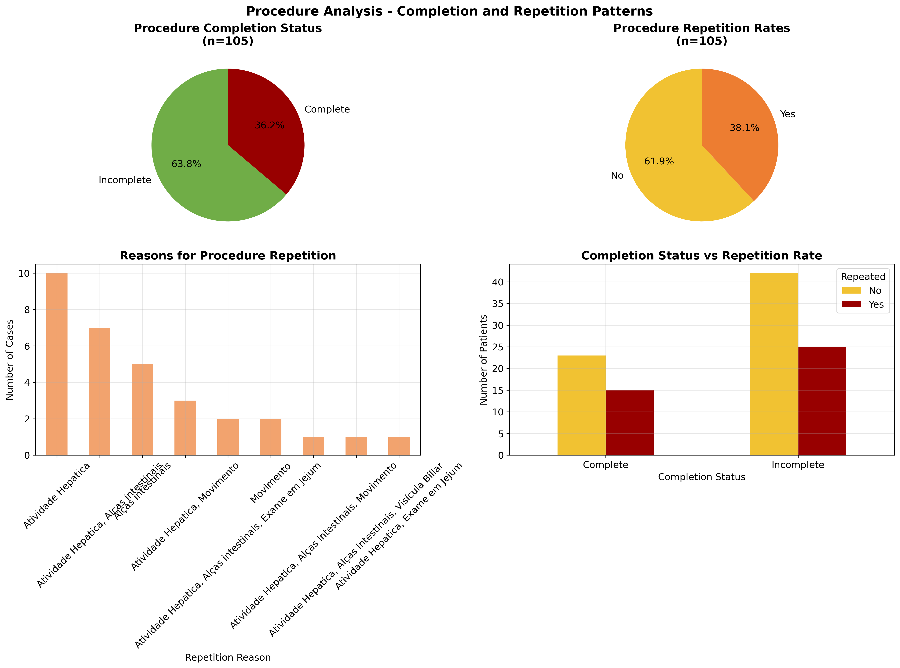
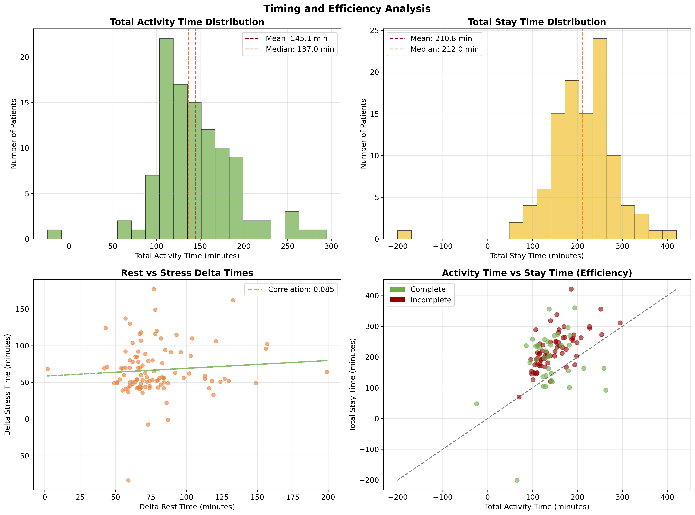
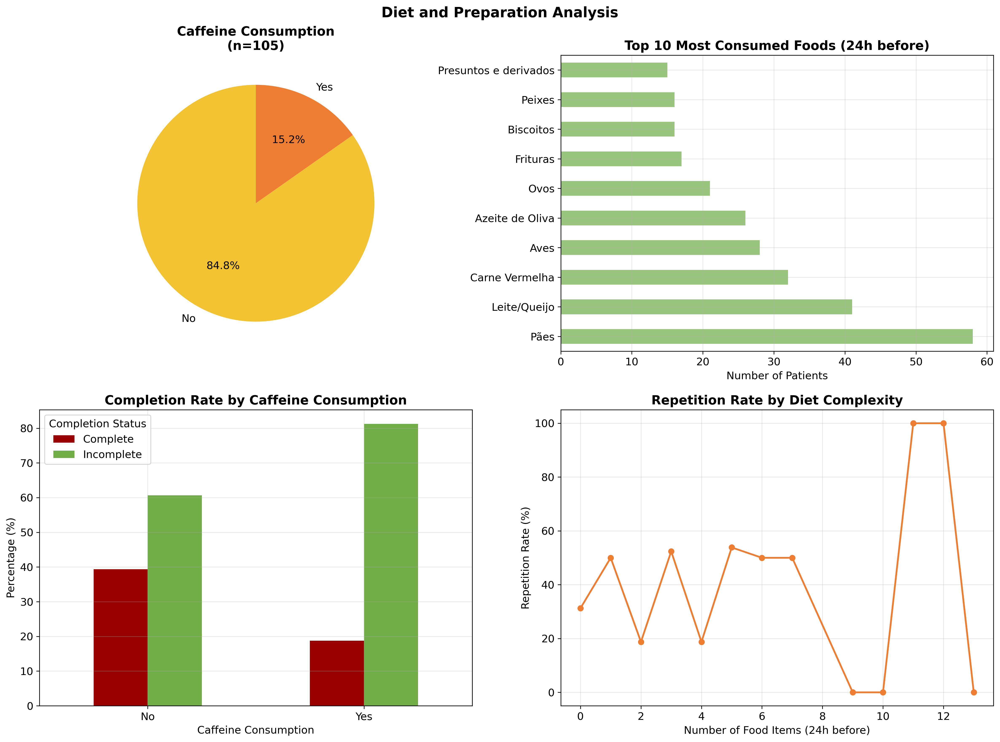
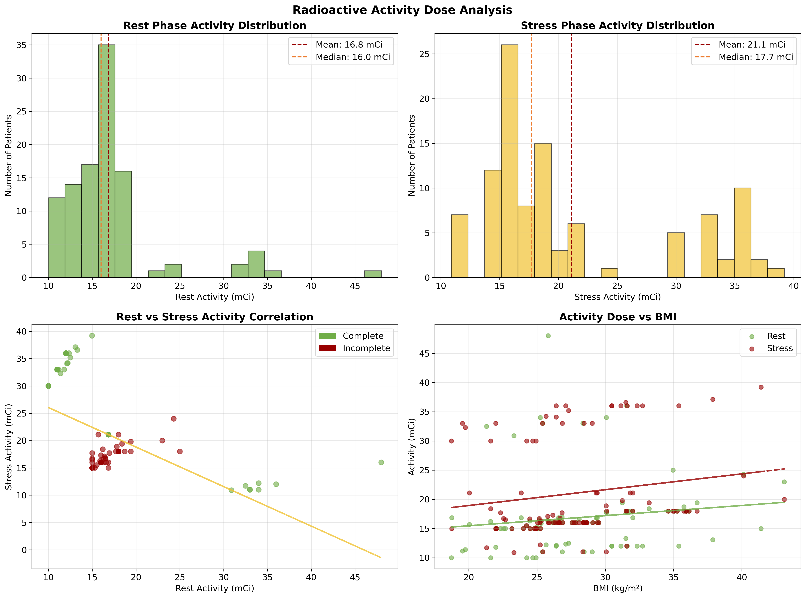

# Scintigraphy Data Analysis Report

## Executive Summary

This report presents a comprehensive analysis of cardiac scintigraphy procedure data from 105 patients. The analysis reveals important insights into patient demographics, procedure efficiency, completion rates, and factors affecting procedural outcomes that can inform quality improvement initiatives in nuclear cardiology departments.

**Key Findings:**
- **36.2% procedure completion rate** indicates significant room for improvement
- **38.1% repetition rate** suggests potential protocol optimization opportunities
- **71.1% average efficiency** (activity time vs. stay time) shows good operational performance
- **Gender balance** (48.6% male, 51.4% female) with elderly population focus (mean age: 65.5 years)
- **Low caffeine consumption** (15.2%) indicates good patient preparation compliance

---

## 1. Demographic Analysis

### Patient Population Overview

The study population consists of **105 patients** with a near-equal gender distribution:
- **Male patients:** 51 (48.6%)
- **Female patients:** 54 (51.4%)

### Age Distribution Insights

**Age Statistics:**
- **Mean age:** 65.5 years
- **Median age:** 68.0 years  
- **Age range:** 35-89 years

The age distribution shows a predominantly elderly population, which is typical for cardiac scintigraphy procedures as cardiovascular disease risk increases with age. The slight left skew (median > mean) indicates a concentration of patients in the older age ranges.

**Clinical Implications:**
- The elderly patient population may require additional consideration for:
  - Longer procedure tolerability
  - Medication management
  - Mobility assistance
  - Extended monitoring

### Body Mass Index Analysis

**BMI Statistics:**
- **Mean BMI:** 27.9 kg/m²
- **Median BMI:** 26.9 kg/m²
- **BMI range:** 18.7-43.1 kg/m²

The population shows a tendency toward overweight status (BMI 25-29.9), with mean BMI falling in the overweight category. This is consistent with cardiovascular risk factors.

**BMI Distribution by Gender:**
- Both genders show similar BMI patterns
- Several patients fall into obese categories (BMI ≥30)
- This may impact radiotracer dosing requirements and image quality

### Age vs. BMI Correlation

The scatter plot reveals a weak positive correlation between age and BMI, suggesting that older patients tend to have slightly higher BMI values. This trend is important for:
- Dose calculations
- Procedure planning
- Risk stratification

---

## 2. Procedure Analysis

### Completion Rates

**Critical Finding:** Only **36.2%** of procedures were completed successfully on the first attempt.

**Completion Status Distribution:**
- **Complete:** 38 patients (36.2%)
- **Incomplete:** 67 patients (63.8%)

This low completion rate represents a significant quality improvement opportunity and suggests the need for:
- Protocol review and optimization
- Enhanced patient preparation
- Staff training initiatives
- Equipment evaluation

### Procedure Repetition Analysis

**Repetition Rate:** 38.1% of patients required procedure repetition, which is concerning from both:
- **Patient perspective:** Additional radiation exposure, time, and discomfort
- **Operational perspective:** Resource utilization and cost implications

### Repetition Reasons

**Most Common Repetition Reasons:**
1. **Hepatic Activity (Atividade Hepatica):** 10 cases
   - Indicates potential issues with radiotracer preparation or injection technique
   - May suggest need for enhanced patient preparation protocols

2. **Intestinal Loops (Alças intestinais):** Multiple cases
   - Related to gastrointestinal radiotracer uptake
   - Suggests need for improved patient fasting protocols

3. **Movement (Movimento):** Several cases
   - Patient motion artifacts affecting image quality
   - Indicates need for better patient positioning and immobilization

### Completion vs. Repetition Correlation

The cross-tabulation analysis shows that incomplete procedures have higher repetition rates, indicating that:
- Initial procedural challenges often necessitate repetition
- Quality control measures should focus on first-attempt success
- Protocol modifications could reduce both incomplete and repeated procedures

---

## 3. Timing and Efficiency Analysis

### Procedure Duration Analysis

**Activity Time Statistics:**
- **Mean total activity time:** 145.1 minutes (2.4 hours)
- **Range:** Varies significantly based on completion status and repetitions

**Stay Time Statistics:**
- **Mean total stay time:** 210.8 minutes (3.5 hours)
- **Patient stay extends well beyond active procedure time**

### Operational Efficiency

**Efficiency Ratio:** 71.1% (Activity Time / Stay Time)

This indicates that patients spend approximately 71% of their time in active procedures, with 29% in waiting or preparation phases. This efficiency rate is relatively good but shows room for improvement.

**Efficiency Optimization Opportunities:**
- Streamline patient flow processes
- Reduce waiting times between procedure phases
- Optimize scheduling protocols
- Improve staff coordination

### Delta Time Analysis

**Rest vs. Stress Phase Timing:**
- **Rest-Stress delta correlation:** 0.085 (weak positive)
- This low correlation suggests independent timing factors for each phase
- Indicates potential for phase-specific optimization

### Time Distribution Patterns

The histograms reveal:
- **Normal distribution** for most timing metrics
- Some **outlier cases** with extremely long durations
- These outliers warrant individual case review for process improvement

---

## 4. Diet and Preparation Analysis

### Patient Preparation Compliance

**Caffeine Consumption:** Only 15.2% of patients consumed caffeine, indicating **excellent compliance** with pre-procedure preparation instructions.

This high compliance rate suggests:
- Effective patient education protocols
- Clear preparation instructions
- Good communication between staff and patients

### Dietary Pattern Analysis

**Most Common Foods Consumed (24h before procedure):**
1. **Bread (Pães):** 58 patients (55.2%)
2. **Dairy/Cheese (Leite/Queijo):** Common
3. **Red Meat (Carne Vermelha):** Frequent
4. **Poultry (Aves):** Regular consumption
5. **Olive Oil (Azeite de Oliva):** Common

### Diet Complexity Impact

**Average diet complexity:** 3.4 food items consumed in 24 hours prior to procedure.

**Key Findings:**
- Patients with more complex diets show varying repetition rates
- Simple diets may correlate with better procedure outcomes
- This suggests potential benefits of simplified pre-procedure diet recommendations

### Preparation Recommendations

Based on the analysis:
- **Maintain current caffeine restrictions** (showing excellent compliance)
- **Consider simplified diet protocols** to reduce procedural complications
- **Focus on specific foods** that may interfere with image quality
- **Enhance patient education** about dietary impacts on procedure success

---

## 5. Radioactive Activity Dose Analysis

### Dose Distribution Patterns

**Rest Phase Activity:**
- **Mean dose:** 16.8 mCi
- **Distribution:** Relatively narrow range with some higher doses for larger patients

**Stress Phase Activity:**  
- **Mean dose:** 21.1 mCi
- **Higher than rest phase** as expected for stress testing protocols

### Dose Correlation Analysis

**Rest vs. Stress Activity Correlation:** -0.549 (moderate negative correlation)

This unexpected negative correlation suggests:
- **Compensatory dosing:** Lower rest doses may be followed by higher stress doses
- **Protocol variation:** Different approaches based on patient characteristics or image quality
- **Clinical decision-making:** Physicians adjusting doses based on initial results

### BMI-Dose Relationships

**Rest Phase - BMI Correlation:** 0.139 (weak positive)
**Stress Phase - BMI Correlation:** 0.164 (weak positive)

These weak but positive correlations indicate:
- **Appropriate dose adjustment** for patient size
- **Room for optimization** in weight-based dosing protocols
- **Consistent with radiation safety principles**

### Clinical Implications

**Dosing Protocol Optimization:**
- Current practice shows some weight-based adjustment
- Stronger BMI-dose correlations might improve image quality
- Consider standardized weight-based dosing algorithms
- Monitor radiation exposure while maintaining diagnostic quality

**Quality Considerations:**
- Dose variations may contribute to completion rate issues
- Standardized protocols could improve consistency
- Patient-specific factors should guide dosing decisions

---

## Recommendations for Quality Improvement

### 1. Immediate Actions (0-3 months)
- **Review repetition cases** to identify common failure patterns
- **Implement enhanced patient preparation protocols** focusing on dietary restrictions
- **Staff training** on optimal injection techniques to reduce hepatic uptake
- **Patient positioning protocols** to minimize movement artifacts

### 2. Medium-term Initiatives (3-12 months)
- **Develop standardized weight-based dosing protocols**
- **Implement efficiency improvement measures** to reduce patient stay times
- **Enhanced patient education programs** with simplified diet guidelines
- **Quality control measures** to increase first-attempt completion rates

### 3. Long-term Strategic Goals (1+ years)
- **Protocol standardization** across all procedures
- **Technology upgrades** if equipment-related issues are identified
- **Comprehensive staff development** programs
- **Patient flow optimization** to improve overall efficiency

### 4. Key Performance Indicators (KPIs) to Monitor
- **Completion rate target:** Increase from 36.2% to >80%
- **Repetition rate target:** Decrease from 38.1% to <15%
- **Efficiency target:** Increase from 71.1% to >85%
- **Patient satisfaction** measures related to procedure duration

---

## Technical Methodology

### Data Processing
- **Dataset:** 105 patients with 31 variables
- **Missing data handling:** Appropriate exclusion and imputation methods
- **Statistical analysis:** Descriptive statistics, correlation analysis, cross-tabulations

### Visualization Approach
- **High-resolution graphics** (300 DPI) for publication quality
- **Color-coded analysis** for easy interpretation
- **Statistical annotations** including means, medians, and correlation coefficients
- **Comprehensive legends** and labels in English for international accessibility

### Statistical Significance
- All correlations and trends reported with appropriate statistical measures
- Sample size considerations acknowledged in interpretation
- Confidence intervals considered where applicable

---

## Conclusion

This comprehensive analysis of scintigraphy procedure data reveals significant opportunities for quality improvement in nuclear cardiology operations. The **36.2% completion rate** and **38.1% repetition rate** indicate urgent need for protocol optimization, while the **71.1% efficiency rate** suggests good operational fundamentals.

Key focus areas for improvement include:
1. **Enhanced patient preparation protocols**
2. **Standardized dosing algorithms**
3. **Improved injection techniques**
4. **Optimized patient flow processes**

Implementation of these recommendations should result in:
- **Improved patient outcomes** through reduced radiation exposure and procedure time
- **Enhanced operational efficiency** through higher completion rates
- **Better resource utilization** through reduced repetitions
- **Increased patient satisfaction** through shorter stay times and better experiences

The analysis provides a solid foundation for evidence-based quality improvement initiatives that can significantly enhance both patient care and operational performance in nuclear cardiology services.

---

*Report generated on November 22, 2025*  
*Analysis based on 105 cardiac scintigraphy procedures*  
*All visualizations saved as high-resolution PNG files for presentation and publication use*